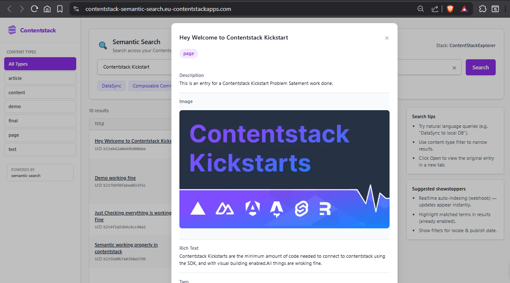
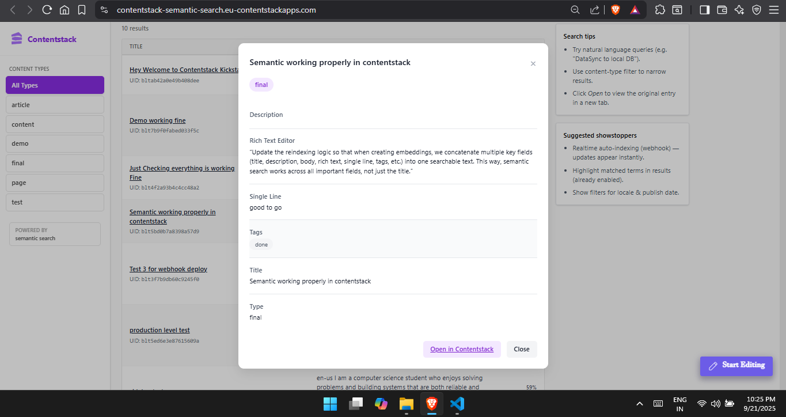
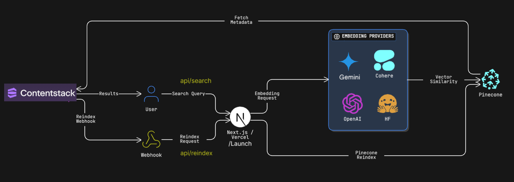
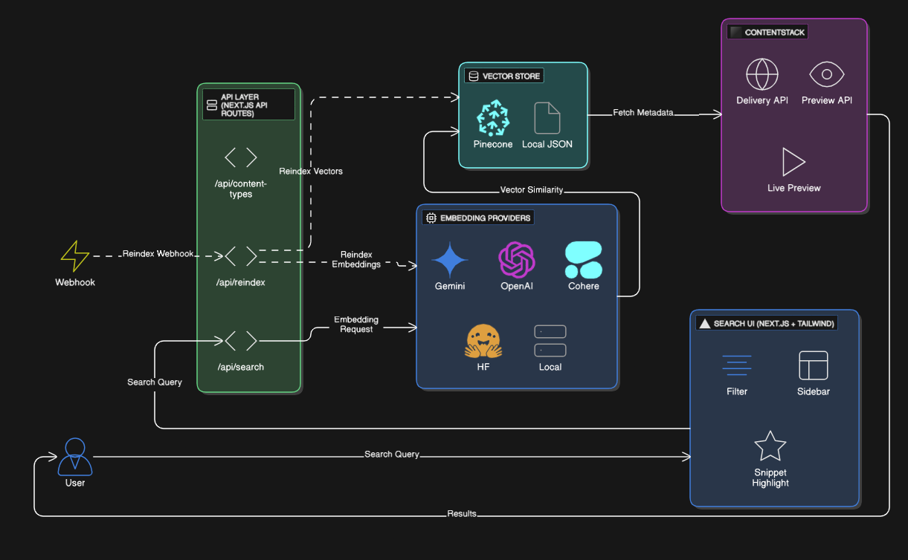

# Contentstack Semantic Search Explorer

> Natural‑language semantic + keyword search across your Contentstack content (embeddings + vector similarity) with a clean UI & Marketplace app integration.


---

## 1. Discovering the Problem

When I first explored ContentStack, finding the right content felt like searching for a needle in a haystack. Typing keywords often missed relevant articles just because the phrasing was different. That’s when I thought — what if search could actually understand meaning instead of just words? That idea sparked the creation of the ContentStack Semantic Search Explorer.

## 2. How I Solved It

I built a solution that blends semantic embeddings with traditional keyword search. It turns content into vector representations that “speak the same language” as your query. Editors can use it inside ContentStack or as a standalone app, making content discovery faster, smarter, and almost effortless.

## 3. Core Features

- 🔍 Hybrid Search: Finds content by meaning and keywords, even if phrasing differs.
- 🗂 Content Filters: Quickly narrow results by content type on desktop or mobile.
- 🎨 Responsive UI: Clean, TailwindCSS-powered interface with accessible focus states.
- 🔌 Flexible Embeddings: Works with multiple providers like Gemini, Cohere, HF, OpenAI, or local.
- ☁️ Vector Storage: Uses Pinecone for fast similarity search, with a local JSON fallback.

---
## 4. UI Preview

<p align="center">
  
</p>
<p align="center">
  
</p>
<p align="center">
  
</p>
> The interface combines:  
> • Left: Persistent content type sidebar filter  
> • Top: Semantic / natural language query bar with suggestions  
> • Center: Ranked results table (desktop) or stacked cards (mobile)  
> • Right: Contextual help / guidance panel  

---

## 5. Architecture & Workflow Diagrams

<p align="center">
  
</p>
<div align="center"><em>fig. High-Level Architecture</em></div>

<p align="center">
  
</p>
<div align="center"><em>fig. Low-Level Architecture</em></div>

Planned / Included Diagram Set:
1. System Architecture (Browser UI → API Routes → Embedding Provider → Vector Store (Pinecone) → Contentstack APIs)  
2. Index / Reindex Flow (Webhook trigger → fetch changed entries → embed → upsert vectors → confirm)  
3. Search Execution Sequence (query submission → embed → similarity query → threshold filtering → enrichment → response)  


---
## 6. Architecture / Tech Stack

| Layer | Tech |
|-------|------|
| UI | Next.js App Router (TS), TailwindCSS |
| CMS | Contentstack Delivery / Preview APIs |
| Embeddings | Gemini / Cohere / HuggingFace / OpenAI / Local service |
| Vector Store | Pinecone (primary) + optional local JSON |
| API | Next.js Route Handlers (`/app/api/*`) |
| Deployment | Vercel (public) + Contentstack App domain |
| Sanitization | DOMPurify |
| Styling | Utility classes (Tailwind) |

High level: Query → /api/search → embed text → vector similarity (Pinecone/local) + keyword fallback → filter + threshold → return normalized scores → client renders + highlights.

---

## 7. Live Deployments

| Environment | URL | Notes |
|-------------|-----|-------|
| Standalone (Vercel) | https://content-stack-semantic-search.vercel.app/ | Public web app |
| Contentstack App Domain | https://contentstack-semantic-search.eu-contentstackapps.com/ | Loaded inside Marketplace iframe |

Both builds share identical code; CSP / frame headers adjusted for iframe embedding.

---


## 8. Installation (Local Dev)

Prereqs: Node 18+, npm, Contentstack stack with content, embedding provider key(s).

```bash
git clone https://github.com/<your-org>/ContentStack-semantic-search.git
cd ContentStack-semantic-search
npm install
cp .env.example .env.local   # fill values
npm run dev
open http://localhost:3000
```

---

## 9. Environment Variables (Used)

Never commit real secrets. (Rotate any keys previously exposed.)

### Embedding / Provider

| Variable | Purpose |
|----------|---------|
| EMBEDDING_PROVIDER | Select provider: gemini | cohere | hf | openai | local |
| GEMINI_EMBEDDING_MODEL | Model id (e.g. `gemini-embedding-001`) |
| GEMINI_API_KEY | Gemini API key (server only) |
| COHERE_API_KEY | Cohere API key |
| HF_API_TOKEN | Hugging Face inference token |
| OPENAI_API_KEY | OpenAI key (if using OpenAI) |
| EMBEDDING_LOCAL_URL | Local embedding service endpoint |
| VECTOR_STORE_DIM | Expected embedding dimension |
| VECTOR_STORE_PERSIST_PATH | Local JSON vector fallback path |

### Vector Index (Pinecone)

| Variable | Purpose |
|----------|---------|
| PINECONE_API_KEY | Pinecone API access |
| PINECONE_INDEX_NAME | Index name |

### Contentstack

| Variable | Purpose |
|----------|---------|
| NEXT_PUBLIC_CONTENTSTACK_API_KEY | Stack API key (safe-ish) |
| CONTENTSTACK_DELIVERY_TOKEN | Delivery token (server only; remove NEXT_PUBLIC) |
| CONTENTSTACK_PREVIEW_TOKEN | Preview token (server only) |
| NEXT_PUBLIC_CONTENTSTACK_ENVIRONMENT | Environment UID / name |
| NEXT_PUBLIC_CONTENTSTACK_REGION | Region (EU / NA / etc.) |
| NEXT_PUBLIC_CONTENTSTACK_PREVIEW | "true" to enable preview mode UI |
| CONTENTSTACK_MANAGEMENT_TOKEN | Management operations (server only) |

### Webhook / Security

| Variable | Purpose |
|----------|---------|
| WEBHOOK_SECRET | Validate inbound reindex webhooks |

### Search Tuning

| Variable | Purpose |
|----------|---------|
| SEARCH_MIN_SCORE | Absolute similarity cutoff |
| SEARCH_RELATIVE_FRACTION | Relative top score retention fraction |
| SEARCH_TOP_K | Max candidates returned pre-filter |

---


## 10. Usage

1. Enter a natural language query (e.g. “Composable commerce starter”).  
2. Press Enter or click the purple Search button.  
3. Filter by content type via sidebar or mobile dropdown.  
4. Click On the entries modal will open showing all the metadata fetched from stack entries.  
5. Adjust provider / thresholds via env vars and redeploy.

Example queries:

| Query | Behavior |
|-------|----------|
| DataSync | Surfaces entries referencing DataSync concepts |
| AI in Healthcare security | Semantic matches on AI + security context |
| Kickstart localization | Finds localization-related Kickstart content |

---

## 11. Project Structure

```
.
├─ app/
│  ├─ api/
│  │  ├─ search/route.ts
│  │  ├─ content-types/route.ts
│  │  └─ reindex/route.ts
│  ├─ page.tsx
│  └─ globals.css
├─ lib/
│  ├─ contentstack.ts
│  ├─ embeddings.ts
│  └─ types.ts
├─ public/
│  ├─ CSlogo.webp
│  └─ ui-preview.png        (add)
├─ next.config.mjs
├─ tailwind.config.js
└─ package.json
```

---


## 13. Future (Planned)

- Hybrid BM25 + vector weighting toggle
- Relevance feedback (interactive re‑rank)
- Query suggestion + auto-complete


---


Happy searching.
