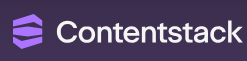
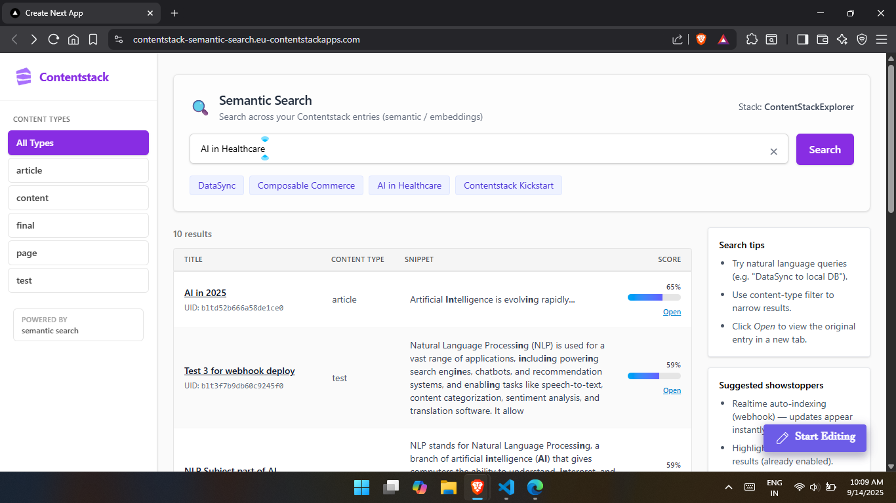

# Contentstack Semantic Search Explorer

> Natural‑language semantic + keyword search across your Contentstack content (embeddings + vector similarity) with a clean UI & Marketplace app integration.

<p align="left">
  
</p>


---

## 1. Overview

Run semantic (embedding) + keyword style queries over Contentstack entries (“Show AI in Healthcare articles about compliance”).  
Embeddable as a Custom / Marketplace App (iframe) inside the Contentstack UI and deployable as a standalone website.  
Goal: accelerate discovery, reuse, and validation of editorial content.

## 2. Why It Exists

Legacy CMS search relies on literal or fuzzy text matching. This app adds embeddings + scoring so intent, synonyms, and semantic proximity drive relevance. Foundation for future AI features (clustering, Q&A, summarization, author assistance).

## 3. Core Features

- 🔍 Hybrid semantic + keyword search
- 🧠 Configurable similarity thresholds & top‑K
- 🗂 Content type filtering (sidebar + mobile)
- 🛰 Live Preview compatible
- 🧩 Marketplace iframe safe (CSP + no unsafe globals)
- 🎨 Tailwind responsive UI & accessible focus states
- 🛡 DOMPurify sanitization of snippets + highlighting
- ♻️ Reindex / search API routes (serverless)
- 🔌 Pluggable embedding providers (Gemini, Cohere, HF, OpenAI, Local)
- ☁️ Pinecone vector index (or local JSON fallback)

## 4. Architecture / Tech Stack

| Layer | Tech |
|-------|------|
| UI | Next.js App Router (TS), TailwindCSS |
| CMS | Contentstack Delivery / Preview APIs |
| Embeddings | Gemini / Cohere / HuggingFace / OpenAI / Local service |
| Vector Store | Pinecone (primary) + optional local JSON |
| API | Next.js Route Handlers (`/app/api/*`) |
| Deployment | Vercel (public) + Contentstack App domain |
| Sanitization | DOMPurify |
| Styling | Utility classes (Tailwind) |

High level: Query → /api/search → embed text → vector similarity (Pinecone/local) + keyword fallback → filter + threshold → return normalized scores → client renders + highlights.

---

## 5. Live Deployments

| Environment | URL | Notes |
|-------------|-----|-------|
| Standalone (Vercel) | https://content-stack-semantic-search.vercel.app/ | Public web app |
| Contentstack App Domain | https://contentstack-semantic-search.eu-contentstackapps.com/ | Loaded inside Marketplace iframe |

Both builds share identical code; CSP / frame headers adjusted for iframe embedding.

---

## 6. UI Preview

(Add your screenshot image file to `public/ui-preview.png` or similar.)

<p align="center">
  
</p>

> Sidebar with content types (left), semantic query bar (top), results table (center), tips panel (right).

---

## 7. (Upcoming) Architecture & Workflow Diagrams

Place planned diagrams here:

1. System Architecture (Client ↔ API ↔ Embedding Provider ↔ Pinecone ↔ Contentstack)  
2. Indexing / Reindex Flow  
3. Search Execution Sequence (timing + thresholding)

Add images under `public/diagrams/` and reference them:

```
public/diagrams/architecture.png
public/diagrams/search-flow.png
```

---

## 8. Installation (Local Dev)

Prereqs: Node 18+, npm, Contentstack stack with content, embedding provider key(s).

```bash
git clone https://github.com/<your-org>/ContentStack-semantic-search.git
cd ContentStack-semantic-search
npm install
cp .env.example .env.local   # fill values
npm run dev
open http://localhost:3000
```

---

## 9. Environment Variables (Used)

Never commit real secrets. (Rotate any keys previously exposed.)

### Embedding / Provider

| Variable | Purpose |
|----------|---------|
| EMBEDDING_PROVIDER | Select provider: gemini | cohere | hf | openai | local |
| GEMINI_EMBEDDING_MODEL | Model id (e.g. `gemini-embedding-001`) |
| GEMINI_API_KEY | Gemini API key (server only) |
| COHERE_API_KEY | Cohere API key |
| HF_API_TOKEN | Hugging Face inference token |
| OPENAI_API_KEY | OpenAI key (if using OpenAI) |
| EMBEDDING_LOCAL_URL | Local embedding service endpoint |
| VECTOR_STORE_DIM | Expected embedding dimension |
| VECTOR_STORE_PERSIST_PATH | Local JSON vector fallback path |

### Vector Index (Pinecone)

| Variable | Purpose |
|----------|---------|
| PINECONE_API_KEY | Pinecone API access |
| PINECONE_INDEX_NAME | Index name |

### Contentstack

| Variable | Purpose |
|----------|---------|
| NEXT_PUBLIC_CONTENTSTACK_API_KEY | Stack API key (safe-ish) |
| CONTENTSTACK_DELIVERY_TOKEN | Delivery token (server only; remove NEXT_PUBLIC) |
| CONTENTSTACK_PREVIEW_TOKEN | Preview token (server only) |
| NEXT_PUBLIC_CONTENTSTACK_ENVIRONMENT | Environment UID / name |
| NEXT_PUBLIC_CONTENTSTACK_REGION | Region (EU / NA / etc.) |
| NEXT_PUBLIC_CONTENTSTACK_PREVIEW | "true" to enable preview mode UI |
| CONTENTSTACK_MANAGEMENT_TOKEN | Management operations (server only) |

### Webhook / Security

| Variable | Purpose |
|----------|---------|
| WEBHOOK_SECRET | Validate inbound reindex webhooks |

### Search Tuning

| Variable | Purpose |
|----------|---------|
| SEARCH_MIN_SCORE | Absolute similarity cutoff |
| SEARCH_RELATIVE_FRACTION | Relative top score retention fraction |
| SEARCH_TOP_K | Max candidates returned pre-filter |

### Example `.env.example` (sanitized)

```bash
EMBEDDING_PROVIDER=gemini
GEMINI_EMBEDDING_MODEL=gemini-embedding-001
GEMINI_API_KEY=YOUR_GEMINI_KEY
VECTOR_STORE_DIM=768
PINECONE_API_KEY=YOUR_PINECONE_KEY
PINECONE_INDEX_NAME=contentstack-semantic-search

# Local vector fallback
# VECTOR_STORE_PERSIST_PATH=./vectorStore.json

NEXT_PUBLIC_CONTENTSTACK_API_KEY=YOUR_STACK_KEY
CONTENTSTACK_DELIVERY_TOKEN=YOUR_DELIVERY_TOKEN
CONTENTSTACK_PREVIEW_TOKEN=YOUR_PREVIEW_TOKEN
NEXT_PUBLIC_CONTENTSTACK_ENVIRONMENT=YOUR_ENV
NEXT_PUBLIC_CONTENTSTACK_REGION=EU
NEXT_PUBLIC_CONTENTSTACK_PREVIEW=false
CONTENTSTACK_MANAGEMENT_TOKEN=YOUR_MGMT_TOKEN

WEBHOOK_SECRET=replace-this

SEARCH_MIN_SCORE=0.22
SEARCH_RELATIVE_FRACTION=0.75
SEARCH_TOP_K=10
```

---

## 10. Usage

1. Enter a natural language query (e.g. “Composable commerce starter”).  
2. Press Enter or click the purple Search button.  
3. Filter by content type via sidebar or mobile dropdown.  
4. Click “Open” to view the entry in a new tab.  
5. Adjust provider / thresholds via env vars and redeploy.

Example queries:

| Query | Behavior |
|-------|----------|
| DataSync | Surfaces entries referencing DataSync concepts |
| AI in Healthcare security | Semantic matches on AI + security context |
| Kickstart localization | Finds localization-related Kickstart content |

---

## 11. Project Structure

```
.
├─ app/
│  ├─ api/
│  │  ├─ search/route.ts
│  │  ├─ content-types/route.ts
│  │  └─ reindex/route.ts
│  ├─ page.tsx
│  └─ globals.css
├─ lib/
│  ├─ contentstack.ts
│  ├─ embeddings.ts
│  └─ types.ts
├─ public/
│  ├─ CSlogo.webp
│  └─ ui-preview.png        (add)
├─ next.config.mjs
├─ tailwind.config.js
└─ package.json
```

---

## 12. Deployment Notes

| Target | Key Steps |
|--------|-----------|
| Vercel | Add env vars → build → ensure no blocking X-Frame-Options |
| Contentstack App | Use Vercel or App Domain URL; add CSP `frame-ancestors` for Contentstack; register Hosted App URL |
| CSP | Include: `frame-ancestors https://app.contentstack.com https://*.contentstack.com` |
| Assets | Place logos / diagrams in `public/` (auto served) |

---

## 13. Future (Planned)

- Multi-locale search + switcher
- Faceted filters (tags, author, date)
- Hybrid BM25 + vector weighting toggle
- Relevance feedback (interactive re‑rank)
- Query suggestion + auto-complete
- Background indexer + queue
- Entry edit deep-links + inline preview actions
- Embedding cache + eviction policy

---

## 14. Security & Key Hygiene

- Do not ship Delivery / Preview / Management tokens with `NEXT_PUBLIC_`.
- Rotate any tokens committed previously.
- Restrict Pinecone index & provider keys via dashboard policies.
- Validate webhooks with `WEBHOOK_SECRET` before reindex actions.

---

## 15. Acknowledgements

Contentstack • Pinecone • Next.js • TailwindCSS • (Gemini / Cohere / Hugging Face / OpenAI) • Community contributors.

---

### Quick Start

```bash
git clone <repo>
cd ContentStackExplorer
npm install
cp .env.example .env.local
# fill env values
npm run dev
```

Happy searching.